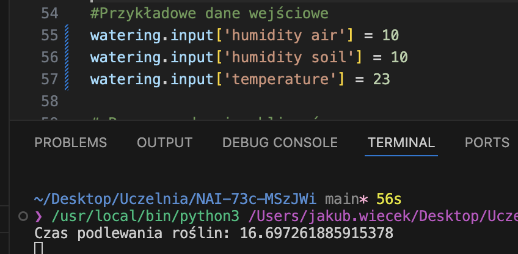
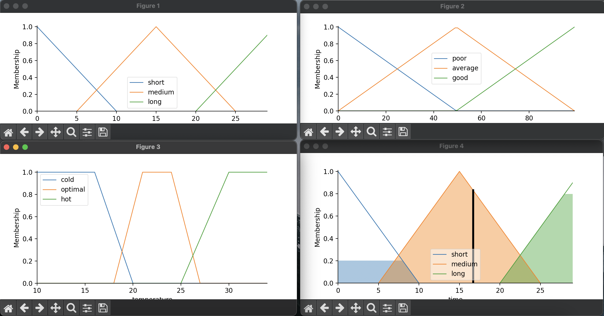
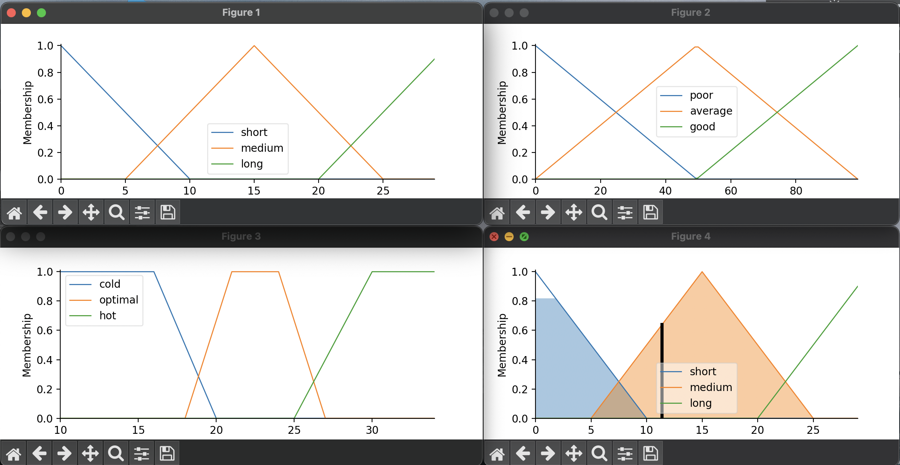

# Fuzzy Logic Plant Watering System

This project implements a greenhouse plant watering control system using fuzzy logic. The system calculates the watering time for plants based on three environmental parameters: air humidity, soil humidity, and temperature. Using fuzzy logic, it determines the appropriate watering time (short, medium, or long) for optimal plant health.

The system is developed in Python using libraries such as `scikit-fuzzy` and `matplotlib`.

## Project Overview

The fuzzy logic-based plant watering system determines the watering time based on three input variables:

- **Air Humidity**: Ranges from 0% to 100%
- **Soil Humidity**: Ranges from 0% to 100%
- **Temperature**: Ranges from 10°C to 35°C

These variables are used to compute the watering duration, which can be classified into three categories:

- **Short**: Short watering time
- **Medium**: Medium watering time
- **Long**: Long watering time

The system is governed by a set of fuzzy rules that define the relationship between the environmental factors and the watering time.

## Features

- Uses fuzzy logic to determine the optimal watering time for plants.
- Considers air humidity, soil humidity, and temperature as inputs.
- Provides a fuzzy inference system to classify watering time as short, medium, or long.
- Developed with Python and makes use of `scikit-fuzzy` for fuzzy logic operations.
- Visualizes the fuzzy logic membership functions and results using `matplotlib`.

## Screenshots

### 1. Example




### 2. Example




## Requirements

Before running the project, make sure you have the following Python libraries installed:

- `scikit-fuzzy`
- `matplotlib`
- `numpy`

You can install them using `pip`:

```bash
pip install scikit-fuzzy matplotlib numpy

