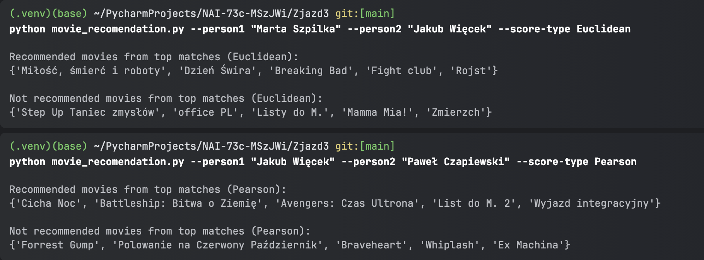

# Recommendation System Based on Similarity Metrics

This project implements a movie recommendation system that compares user preferences using two similarity metrics: **Euclidean Distance** and **Pearson Correlation Coefficient**. The system determines how similar one user is to others based on their movie ratings and recommends movies accordingly.

The system is developed in Python and uses libraries such as `argparse` for command-line parsing and `numpy` for numerical calculations.

---

## Project Overview

The recommendation system uses a dataset of user movie ratings to perform the following tasks:

### Compare User Similarity
- Calculate similarity between users based on their ratings.
- Supports two metrics: **Euclidean Distance** and **Pearson Correlation Coefficient**.

### Recommend Movies
- Suggest movies for a given user based on the preferences of the most similar users.
- Separate recommendations into "recommended" and "not recommended" categories.

## Features

1. **Compare one user to all others** in the dataset or to a specific user.
2. **Recommend movies** that the primary user hasn’t rated but are liked by similar users.
3. Classify movies into:
   - **Recommended**: Highly rated by similar users.
   - **Not Recommended**: Poorly rated by similar users.
4. Support for two metrics:
   - **Euclidean Distance**: Measures the geometric distance between rating vectors.
   - **Pearson Correlation**: Measures the linear correlation between rating vectors.
5. Filters recommendations based on a similarity threshold to ensure quality.

---

## Requirements

Before running the project, ensure you have the following libraries installed:

- `numpy`

You can install the required library using pip:
`pip install numpy`

## Usage

To run the project, provide input arguments as follows:

- `--person1`: The primary user for whom recommendations are generated.
- `--score-type`: The similarity metric to use (`Euclidean` or `Pearson`).
- `--person2`: (Optional) A secondary user to compare against `person1`.

### Examples

1. Compare a user with all others and get recommendations by using the **Euclidean** similarity metric.
2. Compare two specific users by specifying both `--person1` and `--person2`, and choosing the **Pearson** similarity metric.

## Recommendation Process

### Similarity Scores:
- **Euclidean**: A smaller score indicates higher similarity.
- **Pearson**: A higher score (closer to 1) indicates higher similarity.

### Top Matches:
- The system compares a user to the top `n` most similar users.
- A similarity threshold is used to filter out less relevant matches.

### Movie Recommendations:
- Recommends movies based on the ratings from the most similar users.
- Filters out movies with conflicting recommendations (e.g., those rated low by similar users).

## Dataset Format

The dataset is in JSON format and follows this structure:

```json
{
  "User1": {
    "Movie1": 8,
    "Movie2": 7
  },
  "User2": {
    "Movie1": 6,
    "Movie3": 9
  }
}
```

## Examples
Here are some examples of how the system works:

### Example 1: Similarity Scores
1. Example


### Example 2: Comparing Two Users
1. Example


## Authors

Marta Szpilka

Jakub Więcek


