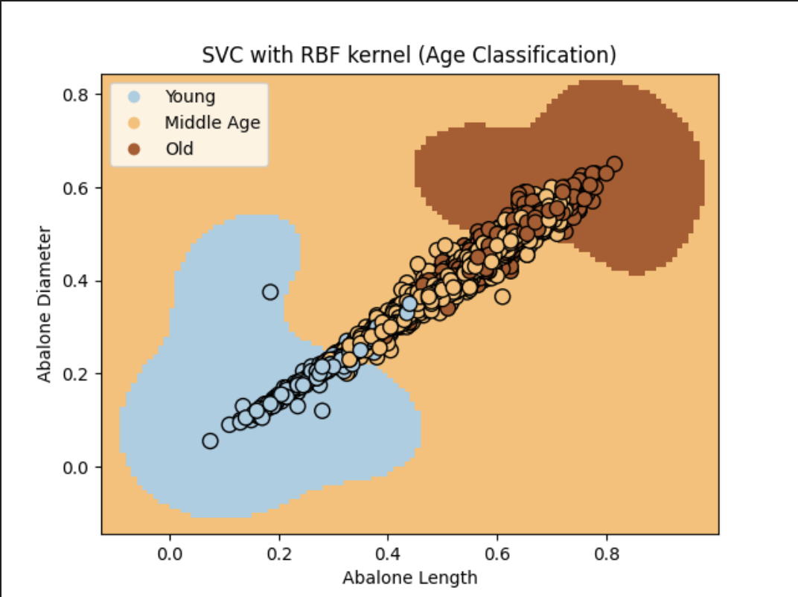
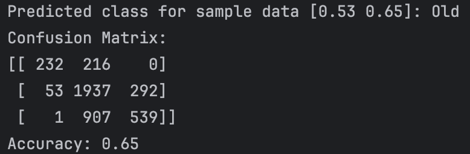
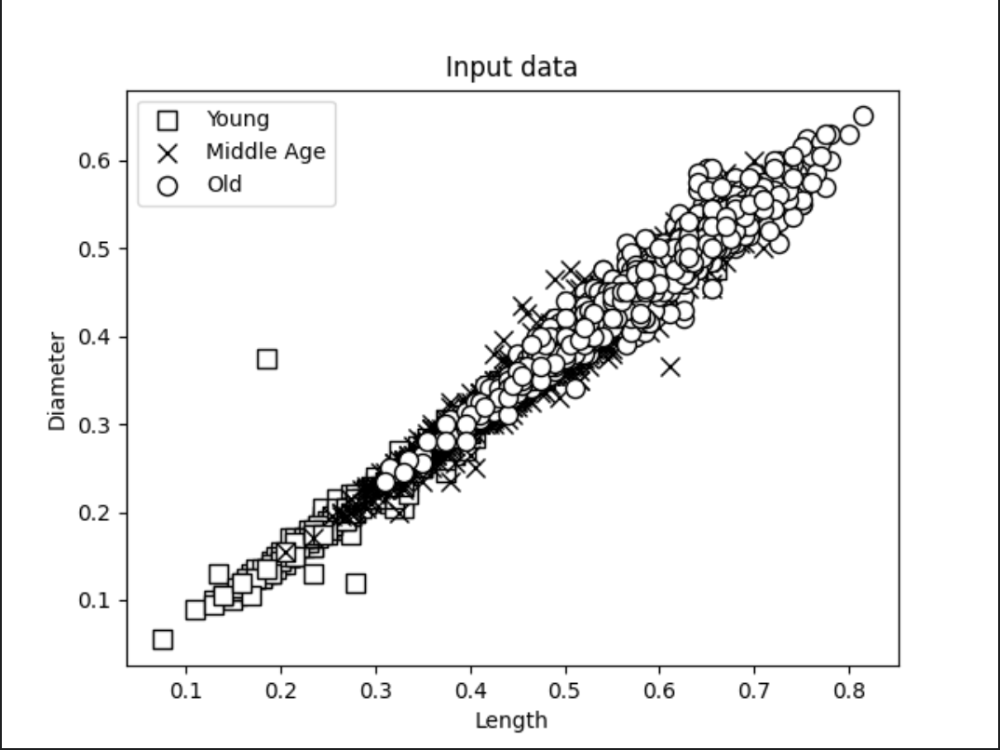
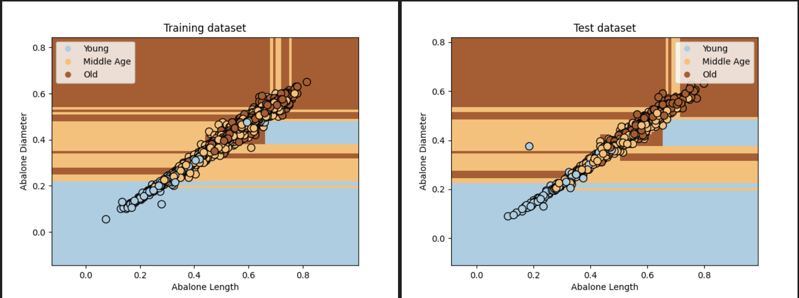
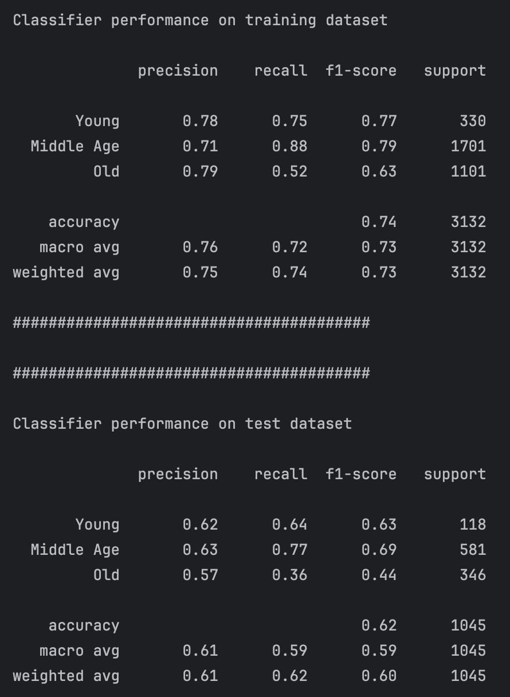
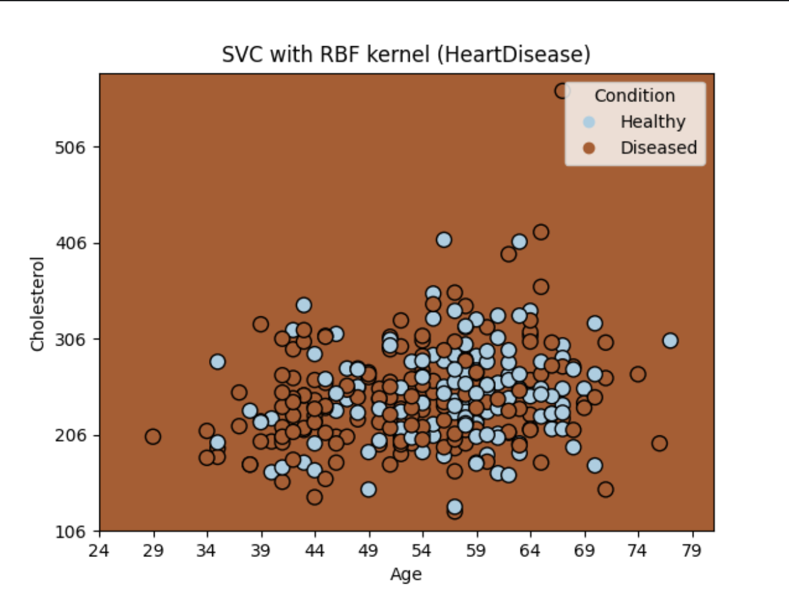
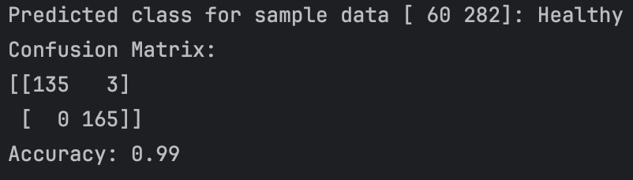
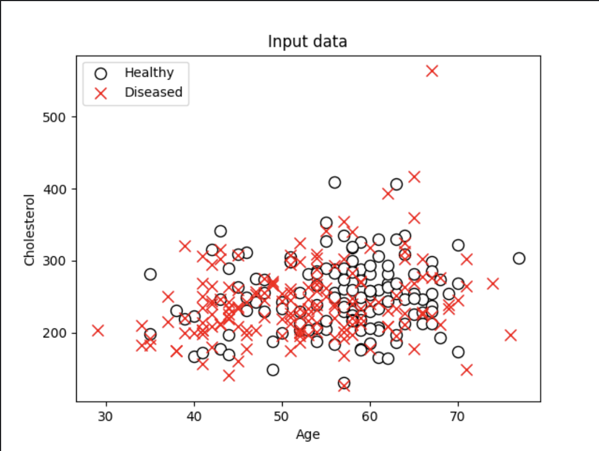
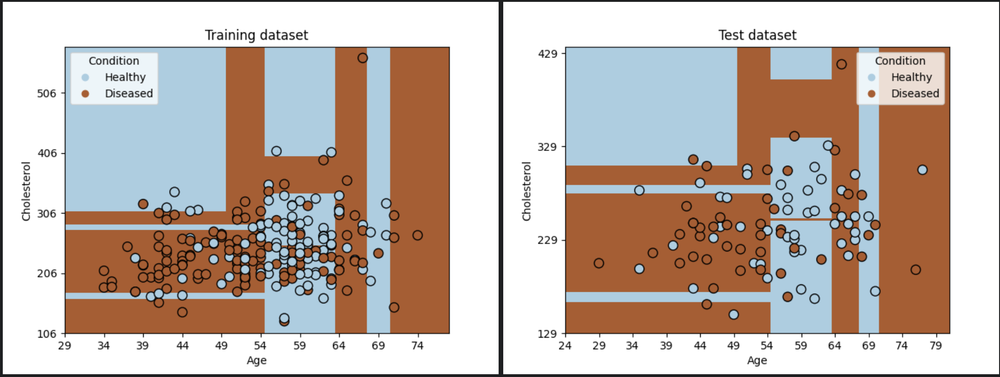
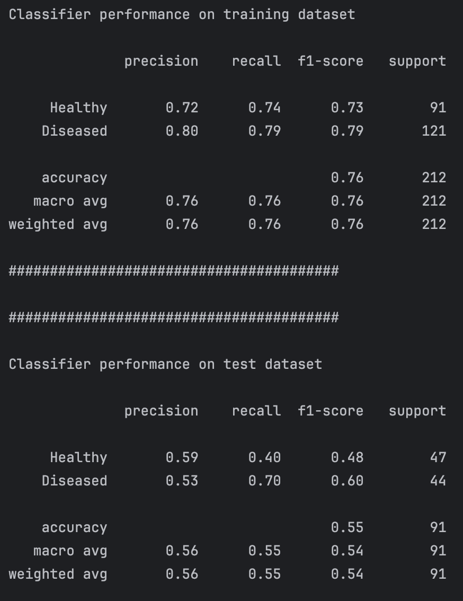

# SVC and Decision Tree Classifiers

## Project Description

This project demonstrates the application of two different classification algorithms:
1. **SVC (Support Vector Classifier)** with an RBF (Radial Basis Function) kernel.
2. **Decision Trees**.

Both algorithms are used for classification tasks on two datasets:
- **Abalone Dataset**: Classifying the age of abalone shells based on their length and diameter.
- **Heart Disease Dataset**: Classifying the presence of heart disease based on age and cholesterol level.

## Project Structure

### Files and Scripts

- `abalone_classification.py`: SVC classifier for the Abalone dataset.
- `decision_tree_abalone.py`: Decision tree classifier for the Abalone dataset.
- `heart_disease_classification.py`: SVC classifier for the Heart Disease dataset.
- `decision_tree_heart_disease.py`: Decision tree classifier for the Heart Disease dataset.
- `utilities.py`: Utility functions for visualizing decision boundaries of classifiers for Abalone dataset.
- `utilities_hd.py`: Utility functions for visualizing decision boundaries of classifiers for Heart Disease dataset.
- `heart.csv`: Heart disease dataset.
- README.md: Documentation for the project (this file).

### Datasets

1. **Abalone Dataset**: Contains information about abalone shells, including length, diameter, and the number of rings, which is used to estimate their age. This dataset is fetched from OpenML.
2. **Heart Disease Dataset**: Contains data about patients, including features like age, cholesterol levels, and whether they have heart disease. This dataset is loaded from a CSV file (`heart.csv`).

## Usage

### Requirements

To run the scripts, make sure you have the following Python packages installed:

- `numpy`
- `matplotlib`
- `pandas`
- `scikit-learn`

You can install them using `pip`:

```bash
pip install numpy matplotlib pandas scikit-learn
```
### Evaluation Metrics

For each classifier, the following evaluation metrics are computed:

- **Confusion Matrix**: A matrix showing the counts of true positive, false positive, true negative, and false negative classifications.
- **Accuracy**: The ratio of correct predictions to total predictions.
- **Classification Report**: Precision, recall, and F1-score for each class.
  
### Running the Scripts and outputs

#### SVC Classifier for Abalone Dataset:

Run the script `abalone_svc.py` to train and visualize an SVC classifier with an RBF kernel on the Abalone dataset. The classifier classifies the age of abalones into three categories: young, middle-aged, and old, based on their length and diameter.

Command:
```
python abalone_svc.py
```
### Axis Visualization

### Output


#### Decision Tree Classifier for Abalone Dataset:

Run the script `abalone_decision_tree.py` to train and visualize a decision tree classifier on the Abalone dataset. This classifier also aims to classify abalones based on their age group (young, middle-aged, and old) using the length and diameter features.

Command:
```
python abalone_decision_tree.py
```

### Axis Visualization



### Output


#### SVC Classifier for Heart Disease Dataset:

Run the script `heart_disease_svc.py` to train and visualize an SVC classifier on the Heart Disease dataset. The classifier predicts whether a patient has heart disease or not based on features such as age and cholesterol levels.

Command:
```
python heart_disease_svc.py
```

### Axis Visualization 


### Output


#### Decision Tree Classifier for Heart Disease Dataset:

Run the script `heart_disease_decision_tree.py` to train and visualize a decision tree classifier on the Heart Disease dataset. This classifier also predicts whether a patient is healthy or diseased based on age and cholesterol levels.

Command:
```
python heart_disease_decision_tree.py
```

### Axis Visualization 



### Output


## Authors

Marta Szpilka
Jakub Więcek
