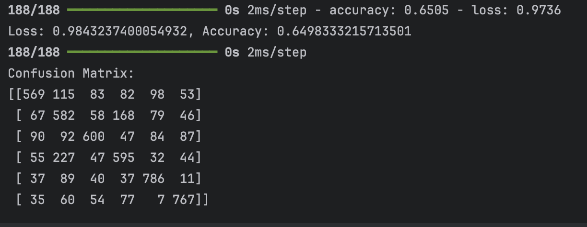
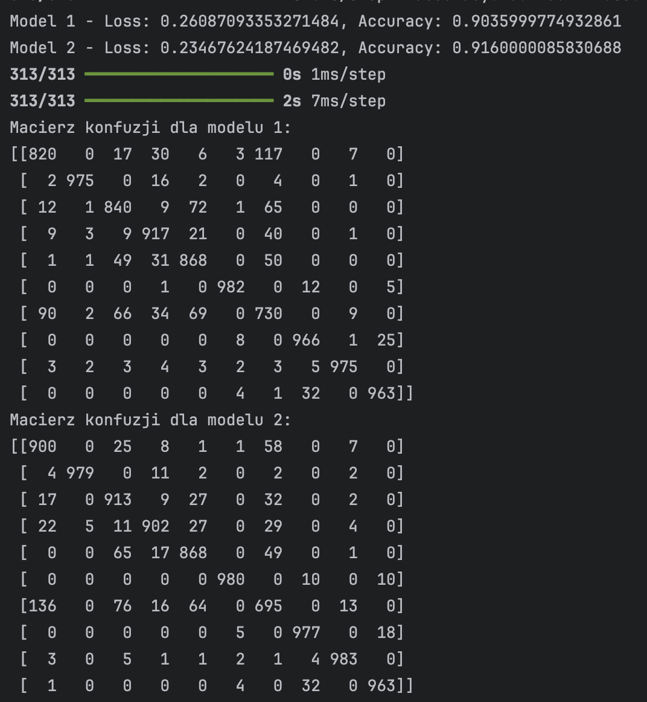
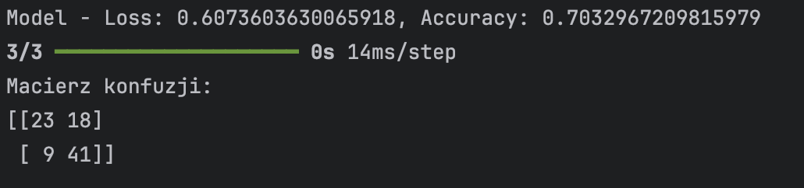
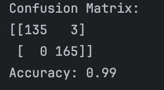

# Neural Networks for Image Classification and Heart Disease Prediction

## Project Description

This project demonstrates the use of neural networks for two distinct tasks:

1. **Animal Image Classification**: A convolutional neural network (CNN) is applied to classify images of animals from the CIFAR-10 dataset.
2. **Clothing Image Classification**: A CNN is used for classifying images of clothing from the Fashion MNIST dataset.
3. **Heart Disease Prediction**: A feedforward neural network (FNN) is used to predict the presence of heart disease based on patient data.
4. **Tom and Jerry Image Classification**: A CNN is used to classify images from the "Tom and Jerry" dataset. This model can identify whether the image contains Tom, Jerry, both, or neither. The dataset is available from [Kaggle: Tom and Jerry Image Classification](https://www.kaggle.com/datasets/balabaskar/tom-and-jerry-image-classification/data).

Each model is evaluated using various performance metrics such as accuracy, loss and confusion matrix.

## Project Structure

### Files and Scripts

- `animals.py`: Classifies images of animals from the CIFAR-10 dataset. It filters the dataset to include only animal classes and trains a CNN model.
- `clothes.py`: Classifies images from the Fashion MNIST dataset using two different CNN architectures (small and large).
- `heart_disease.py`: Predicts heart disease presence using a feedforward neural network. The dataset used contains various medical attributes like age, cholesterol level, and more.
- `heart.csv`: CSV file containing patient data for the heart disease classification task.
- `tom_and_jerry.py`: Classifies images from the "Tom and Jerry" dataset. It uses a CNN to predict whether the image contains Tom, Jerry, both, or neither.
- README.md: Documentation for the project (this file).

### Datasets

1. **CIFAR-10 Dataset**: A dataset containing 60,000 32x32 color images in 10 classes, with a focus on animal-related classes.
   - Animal classes: bird, cat, deer, dog, frog, and horse.
2. **Fashion MNIST Dataset**: A dataset of 60,000 28x28 grayscale images of 10 clothing items.
3. **Heart Disease Dataset**: A dataset of 303 records with 14 features used to predict the presence or absence of heart disease.
4. **Tom and Jerry Dataset**: A dataset containing images of Tom and Jerry characters. The task is to classify images into four categories: Tom, Jerry, Both, None.

## Usage

### Requirements

To run the scripts, make sure you have the following Python packages installed:

- `numpy`
- `tensorflow`
- `matplotlib`
- `pandas`

You can install them using `pip`:

```bash
pip install numpy tensorflow matplotlib pandas
```

### Evaluation Metrics

For each model, the following evaluation metrics are computed:

- **Confusion Matrix**: A matrix showing the counts of true positive, false positive, true negative, and false negative classifications.
- **Accuracy**: The ratio of correct predictions to total predictions.

## Running the Scripts

### Animal Image Classification (CIFAR-10)

Run the script `animals.py` to classify animal images from the CIFAR-10 dataset.

Command:
```bash
python animals.py
```

#### Output
The script will display:
- The model's accuracy and loss on the test dataset.
- The confusion matrix for the predictions.



### Clothing Image Classification (Fashion MNIST)

Run the script `clothes.py` to classify images of clothing from the Fashion MNIST dataset. This script uses two models with different architectures (small and large) for classification.

#### Command:
```bash
python clothes.py
```

#### Output
- Displays accuracy and loss for both models.
- Prints confusion matrices for both models.


#### Comparison of Two Models

In this project, we trained two different Convolutional Neural Networks (CNNs) on the **Fashion MNIST** dataset and evaluated their performance:

- **Model 1 Accuracy**: 0.903
- **Model 2 Accuracy**: 0.916

The models were evaluated using accuracy, and the results were very close, with Model 2 achieving slightly better performance.

#### Model Architecture Details:
- **Model 1**: Smaller CNN with fewer filters and layers.
- **Model 2**: Larger CNN with more filters and layers, which performed slightly better on the classification task.

The evaluation metrics for both models were computed, and both showed a good level of performance for the Fashion MNIST classification task.

### Heart Disease Prediction

Run the script `heart_disease.py` to predict the presence of heart disease based on patient attributes such as age, cholesterol level, and resting blood pressure. This script uses two models with different architectures to classify patients into two categories: heart disease present or absent.

Command:
```bash
python heart_disease.py
```

#### Output
- Displays loss and accuracy.
- Shows the classification results.



#### Comparison with Previous Project Using SVC

In addition to the neural networks implemented in this project, we compared the results of image classification and heart disease prediction with a previous project where we used Support Vector Classifier (SVC). The results showed a significant difference in performance:



- **SVC Accuracy**: 0.99
- **Neural Network Accuracy**: 0.70

This comparison highlights the potential advantages of using SVC for certain classification tasks, especially in cases where the model's complexity and training time need to be minimized. However, neural networks can still offer better performance in more complex scenarios, particularly for image-related tasks.


## Authors

- Marta Szpilka
- Jakub Więcek
